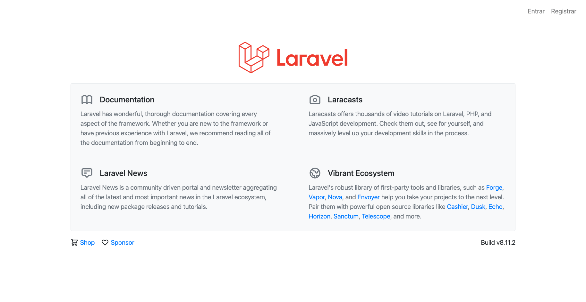
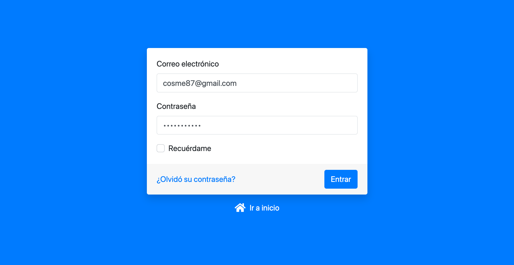
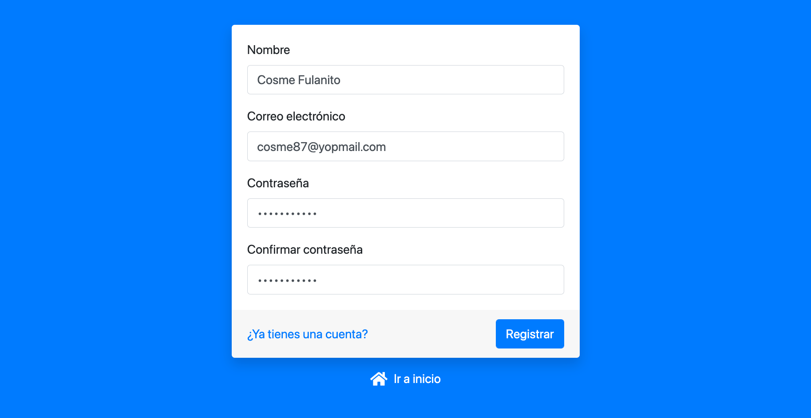
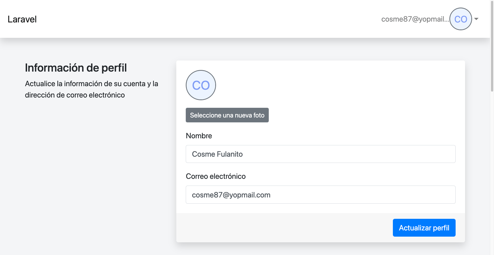

## Fortify y Bootstrap 4

Laravel Jetstream usa Fortify y Tailwind  y no me gusta Tailwind, por eso cree este proyecto que usa Laravel Fortify y Bootstrap 4.

### Instalación 

### Paso 1
```
composer install
````

### Paso 2
```
php artisan migrate
````

### Paso 3
Crea tu archivo .env usando de ejemplo el archivo .env.example:
```
cp .env.example .env
````

### Paso 4
Modifica tu archivo .env con la configuración de tu base de datos.


### Paso 5
Crea un enlace simbólico para acceder desde la carpeta public a la carpeta storage:
```
php artisan storage:link
````

### Paso 6
Entra a localhost/register y crea un nuevo usuario para poder ingresar al panel


### Capturas de pantalla

#### localhost/


#### localhost/login


#### localhost/register


#### localhost/profile

